# Library Management System

A simple website for library management system on Java and SQL server

## Technology
#### Front-End
- HTML5
- CSS
- Bootstrap 4
- JavaScript

#### Back-End
- Java
- JSP
- Servlet
##### Lilaray
- JSTL
- JDBC

#### Database management system
- SQL Server

## Main feature
- Login / sign up
- User management
- Book management
- Borrow list management
- Borrow book by user
- Send feedback
- There are many other features...

## Installation

1. Clone the repo:

```bash
$ git clone https://github.com/nguyentuanninh/library-management-system.git
```
2. Enter your SQL server password in DBContext.java
````bash
    private final String password = "12345678";
````
3. Run file DBScript.sql
<br/>
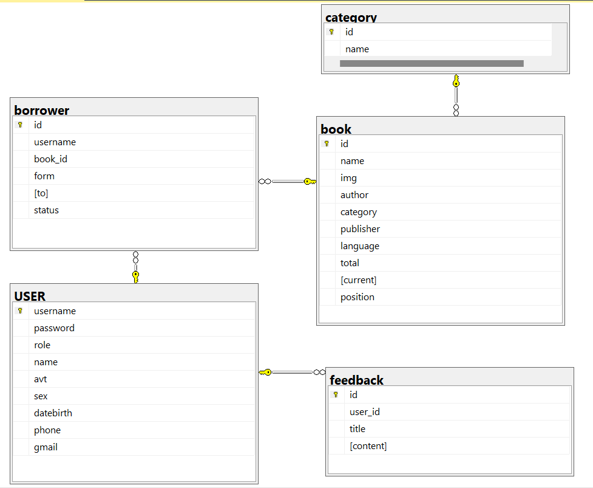

## Main interface
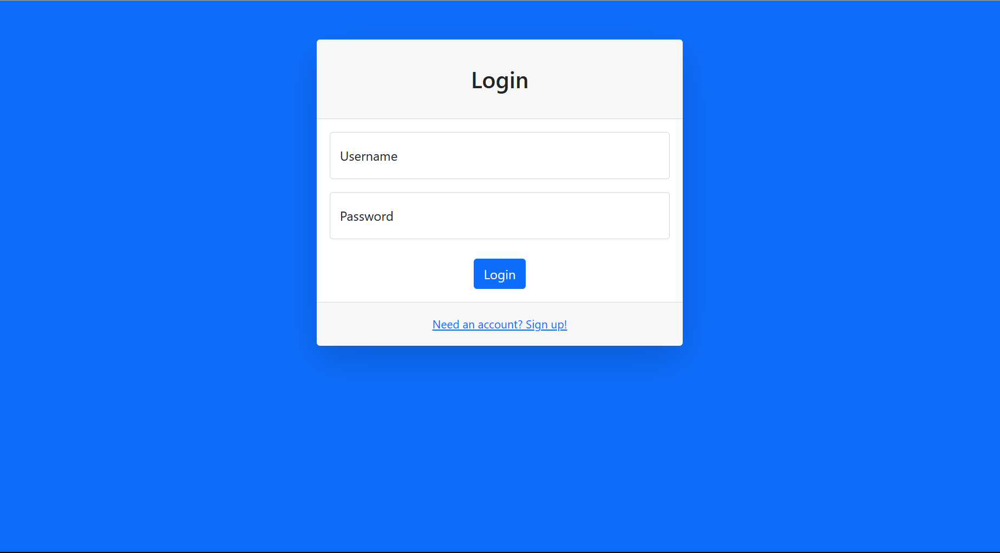  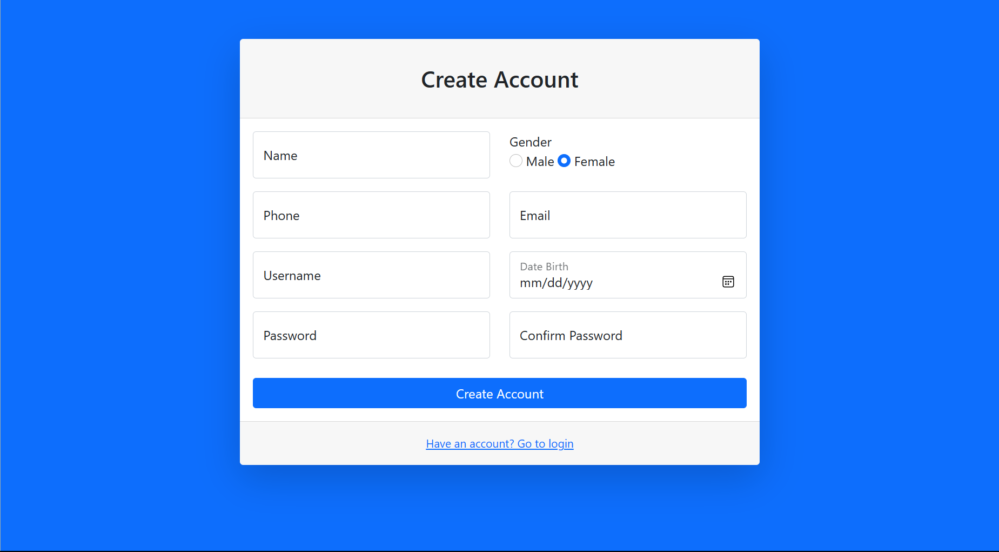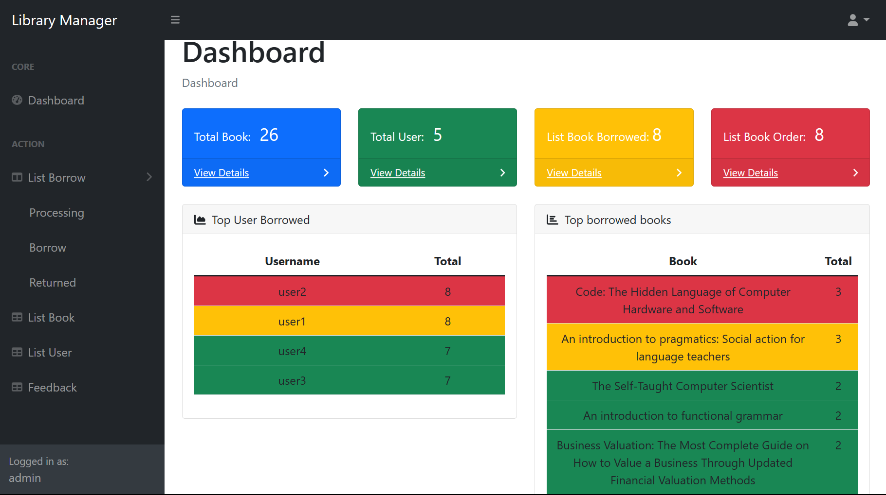

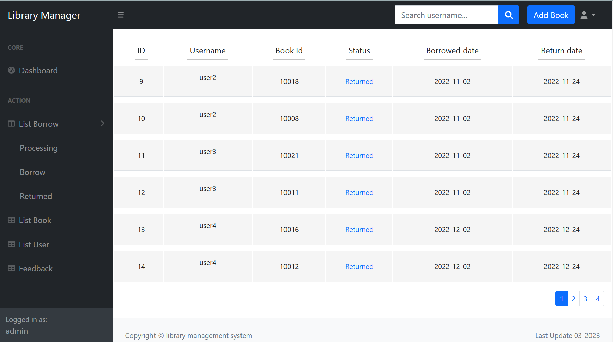  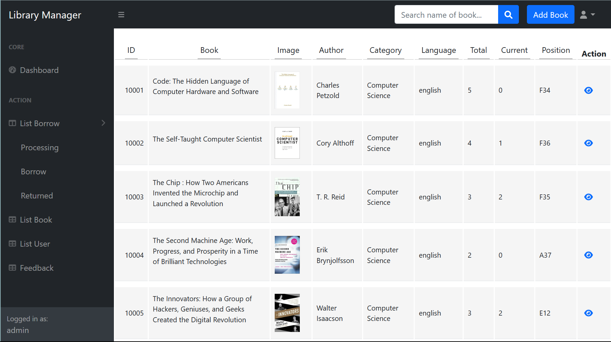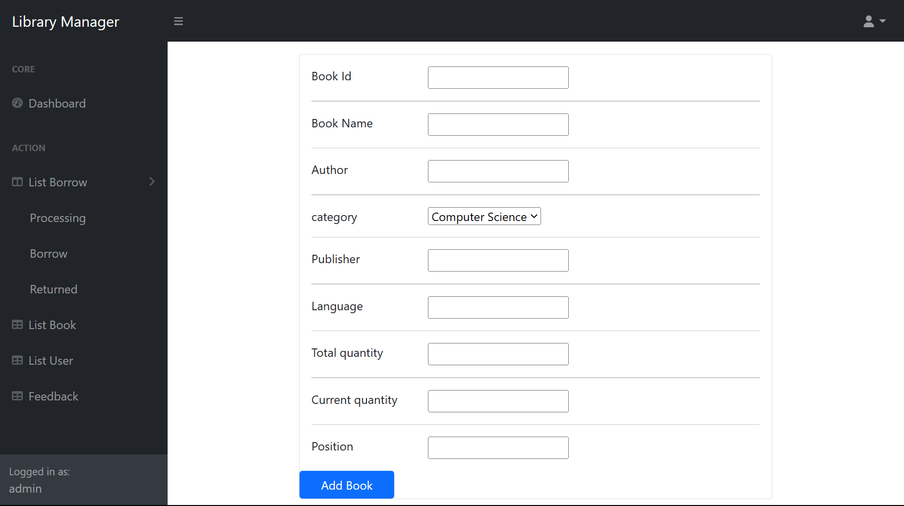

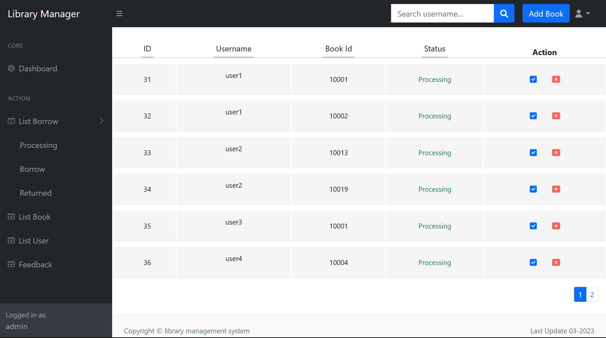    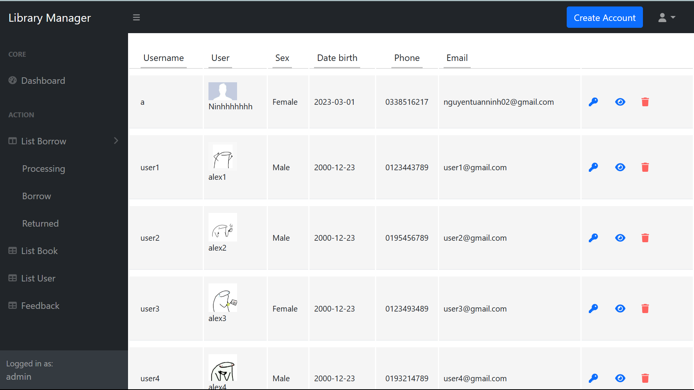

   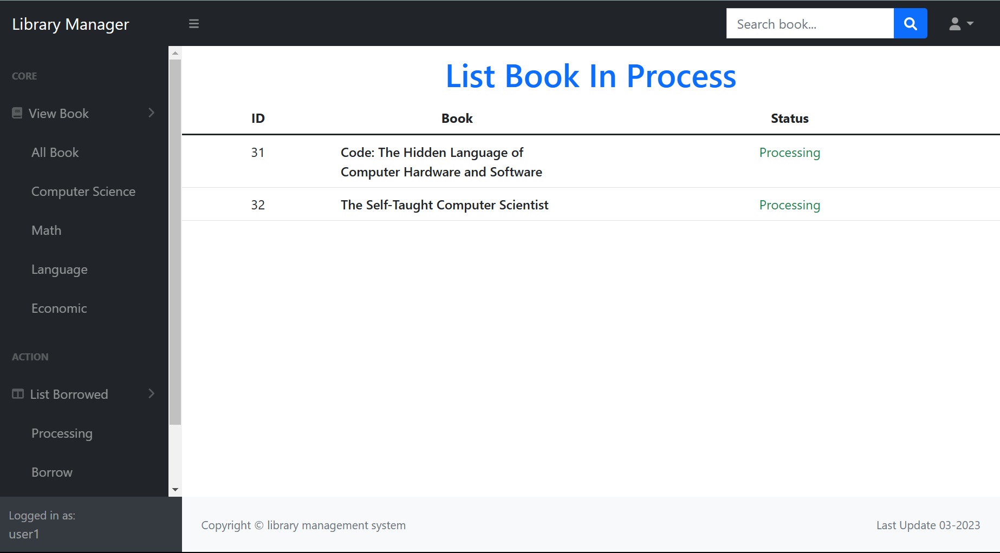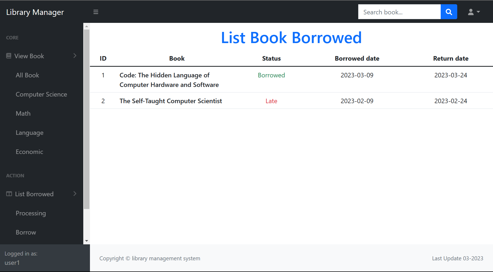

     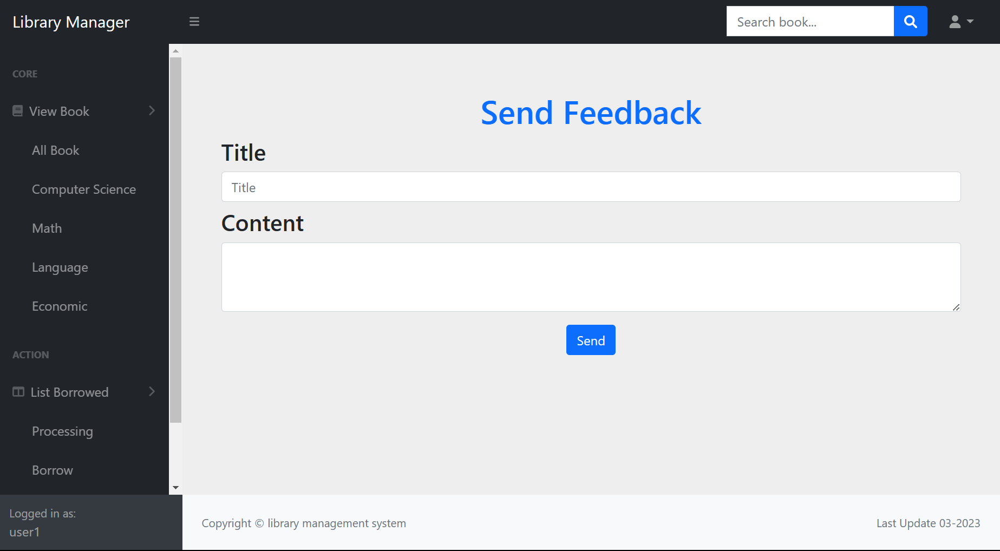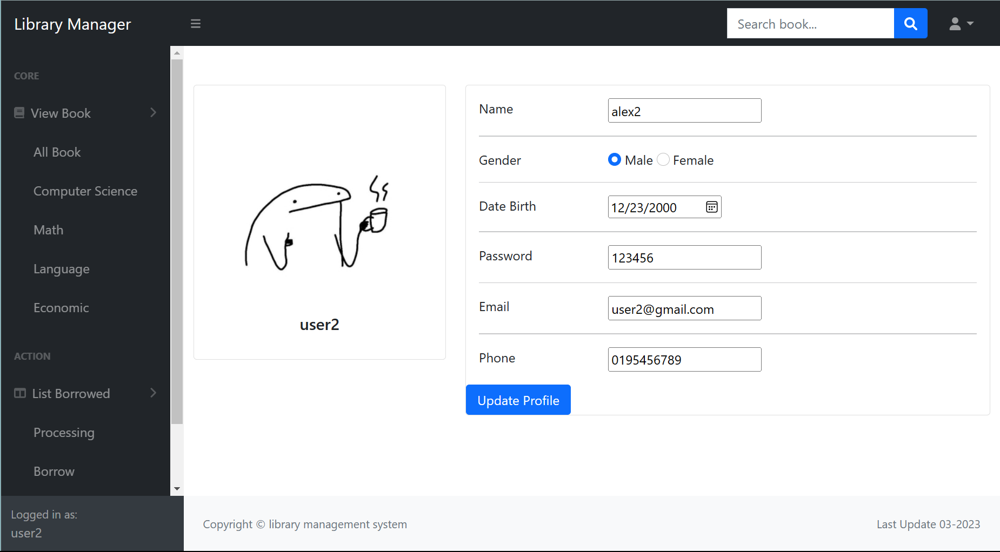
